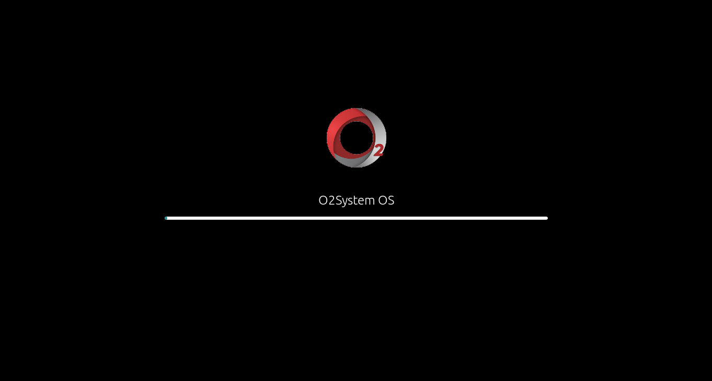
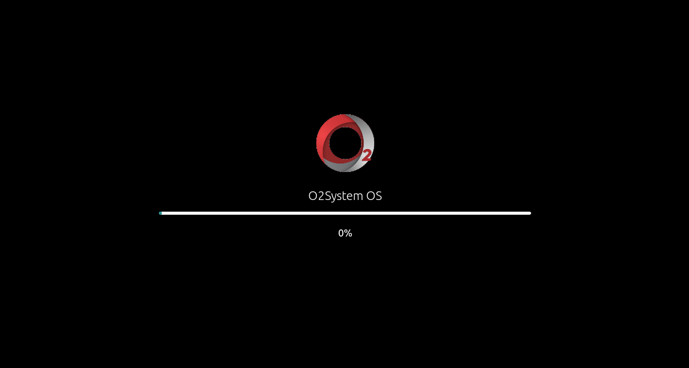
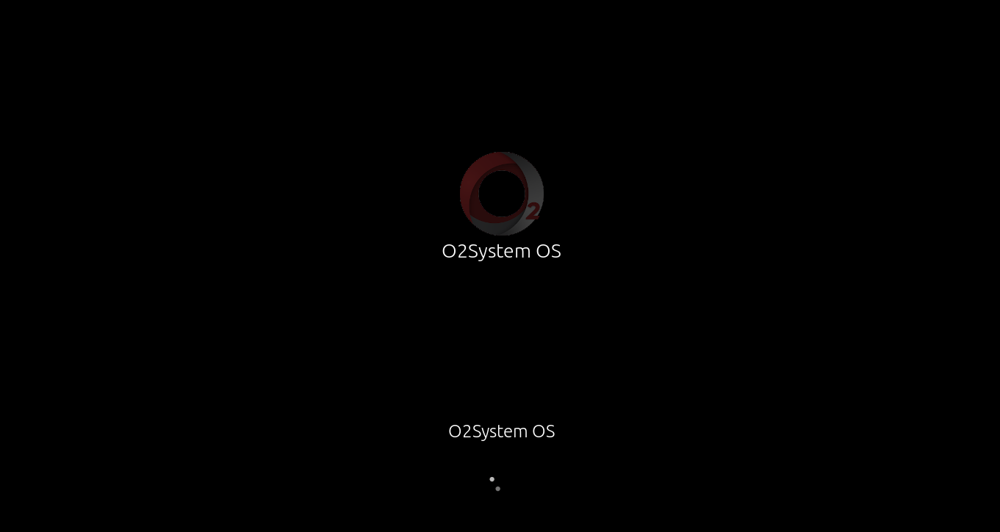

# How To install

1. open terminal
2. enter this command
```
git clone https://github.com/o2system/o2system_plymouth
cd o2system_plymouth
chmod ug+x ./install.sh
./install.sh
```
# How to Edit

1. open terminal
2. enter this command
```
sudo vim /usr/share/plymouth/themes/o2system_bar/o2system_bar.script
```
(to edit o2system_bar Plymouth)

```
sudo vim /usr/share/plymouth/themes/o2system_bar_text/o2system_bar_text.script
```
(to edit o2system_bar_text Plymouth)

```
sudo vim /usr/share/plymouth/themes/o2system_circle/o2system_circle.script
```
(to edit o2system_circle Plymouth)

## Screen shoot



